# NETHIC AI - Enterprise-Grade Autonomous Agent Swarm Framework


**NETHIC is a decentralized AI platform on blockchain for secure on-chain training and NFT-based model ownership.**

[](https://twitter.com/NETHICINFRA)
[](https://twitter.com/alexgeorgeedu)
[](https://linkedin.com/in/-alexgeorge)
[](https://nethicai.com/)


## 🌟 Features

| **Swarm Intelligence** | **Enterprise Security** | **Performance** |
|------------------------|-------------------------|-----------------|
| • Dynamic agent discovery via CRDTs | • Zero-trust gRPC-MTLS | • 1M msg/sec per agent |
| • Federated learning with TFHE | • Hardware-bound JWT authentication | • <5ms E2E latency |
| • Contract Net Protocol (FIPA) | • GDPR/CCPA audit trails | • 99.999% uptime SLA |
| • Chaos-resilient consensus | • Quantum-safe Kyber-1024 | • 10x TCO reduction |

## 🏗️ Architecture

```mermaid
%% NETHIC  AI Technical Architecture Diagram
graph TD
    subgraph Cloud_Providers
        AWS[AWS Region]
        GCP[GCP Region]
        Azure[Azure Region]
    end

    subgraph Control_Plane
        CP1[Consensus Manager]
        CP2[Global State Store]
        CP3[Federated Orchestrator]
        CP4[Auto-Scaler]
    end

    subgraph Data_Plane
        DP1[Agent Pods]
        DP2[Kafka Cluster]
        DP3[PostgreSQL HA]
        DP4[Neo4j Cluster]
    end

    subgraph Security_Stack
        SS1[SPIFFE Identity]
        SS2[Kyber-1024 TLS]
        SS3[Vault Secrets]
        SS4[OPA Policies]
    end

    subgraph Edge_Network
        EN1[5G MEC Node]
        EN2[IoT Gateway]
        EN3[Field Agent]
    end

    subgraph Observability
        OB1[Prometheus/Thanos]
        OB2[Loki/Tempo]
        OB3[Grafana Labs]
        OB4[OpenTelemetry]
    end

    %% Core Connections
    Cloud_Providers -->|Multi-Cloud Sync| Control_Plane
    Control_Plane -->|gNMI Telemetry| Data_Plane
    Data_Plane -->|Envoy mTLS| Security_Stack
    Security_Stack -->|SPIRE| Edge_Network
    Edge_Network -->|WireGuard| Cloud_Providers
    Observability -->|OTLP| Data_Plane
    
    %% 
    classDef cloud fill:#3A4F6E,stroke:#2B3A5A;      
    classDef control fill:#1F4788,stroke:#16325C;   
    classDef data fill:#2E8540,stroke:#245C33;      
    classDef security fill:#D14032,stroke:#A33126;  
    classDef edge fill:#6E509F,stroke:#543D87;      
    classDef obs fill:#FFC107,stroke:#D39E00;       
    
    class Cloud_Providers cloud;
    class Control_Plane control;
    class Data_Plane data;
    class Security_Stack security;
    class Edge_Network edge;
    class Observability obs;
                   
```



## 🚀 Quick Start
### 1. Run with Docker (Dev Mode)
```
git clone https://github.com/NETHIC-ai/core.git
cd core/deploy

# Start minimal cluster (Agent + Redis + Observability)
docker compose -f docker-compose-dev.yml up --detach

# Submit sample task
curl -X POST http://localhost:8080/v1/tasks \
  -H "X-API-Key: DEMO_KEY" \
  -d '{"protocol":"contract_net", "payload":{"task_id":"geo-sat-001"}}'
```

### 2. Verify Deployment
```
# Check agent health
curl http://localhost:8080/v1/health

# Monitor metrics (Prometheus)
open http://localhost:9090

# View real-time logs (Loki)
open http://localhost:3100
```

## 📦 Installation
### Prerequisites
- Kubernetes 1.25+ (Production) / Docker 20.10+ (Dev)
- NVIDIA GPU with CUDA 12.1 (Optional for AI workloads)
- 8 GB RAM (Min) / 64 GB RAM (Production)

### Helm Deployment (Production)
```
helm repo add biconic https://helm.NETHIC.ai
helm install biconic-agent sazmir/NETHIC-agent \
  --namespace aelion-prod \
  --set global.tls.autoCert=true \
  --set autoscaler.minReplicas=10 \
  --values https://config.NETHIC.ai/v1/production.yaml
```

## ⚙️ Configuration
### Environment Variables
```
# .env.production
AELION_DEPLOY_MODE=hybrid
AELION_CRYPTO_PROVIDER=kyber1024
AELION_TELEMETRY_ENDPOINT=https://telemetry.sazmir.ai/v1/ingest
AELION_LICENSE_KEY=eyJhbGciOiJSUzI1NiIsInR5cCI6... # JWT-Encrypted
```

### Core Parameters

| Parameter | Description | Default |
|:--------------|:--------------:|--------------:|
| swarm.quorum_size       | Minimum agents for consensus	         | 7        |
| federation.max_latency_ms       | Cross-DC latency threshold         | 150        |
| telemetry.sampling_rate       | Observability data sampling         | 0.05        |


## 🔒 Security
### Certificates
```
# Generate quantum-safe certs (Kyber-1024)
openssl req -x509 -newkey kyber1024 \
  -keyout key.pem -out cert.pem \
  -days 365 -nodes -subj "/CN=sazmir.ai"
```

### Audit Trails
```
# Example: Immutable audit logger
from aelion.audit import QuantumAuditLogger

qlogger = QuantumAuditLogger(
    ledger_type="blockchain",
    post_quantum_sig=True
)
qlogger.log_operation(
    user="admin@sazmir.ai",
    action="agent_scale_up",
    params={"replicas": 100}
)
```

## 📊 Benchmarks
| Scenario | vCPUs | Throughput | Latency |
|:--------------|:--------------:|--------------:|--------------:|
| Contract Net (100 agents)       | 16	         | 12K tasks/sec        | 8ms ±1.2        |
| Federated Learning (10 nodes)       | 64         | 3TB/hr        | 92ms ±5.6        |
| Disaster Recovery Failover       | 128         | N/A        | 1.3s P99        |
